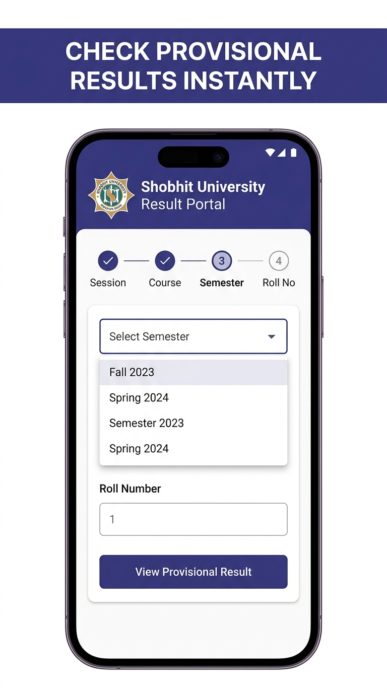
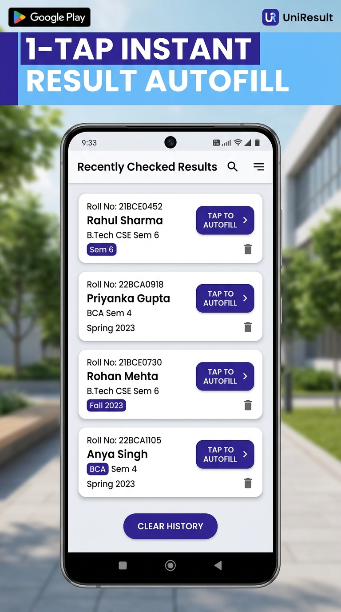
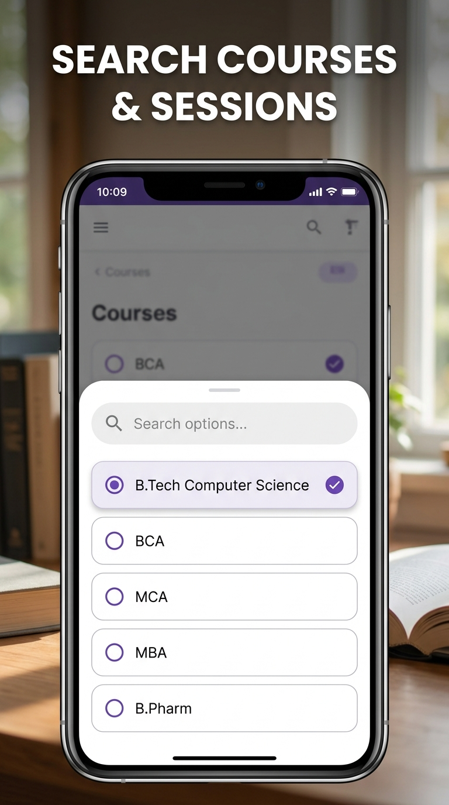
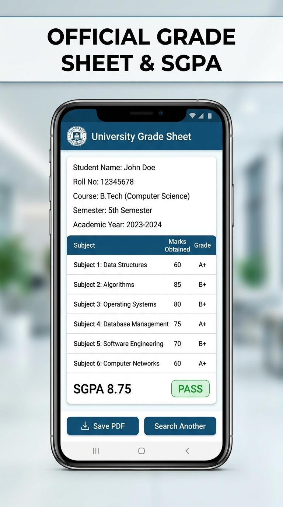
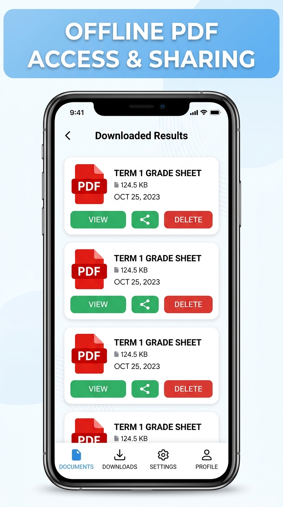

# 🎓 SugResults — Shobhit University Result Portal

<p align="center">
  
</p>

<p align="center">
  <b>A modern, high-performance, and secure mobile application for students of Shobhit University Gangoh to check, download, and manage provisional grade sheets instantly.</b>
</p>

<p align="center">
  
  
  
  
</p>

---

## 📱 App Preview & Screenshots

<p align="center">
  
  &nbsp;
  
  &nbsp;
  
  &nbsp;
  
  &nbsp;
  
</p>

---

## 🌟 Key Features

- **⚡ Instant Result Retrieval**: Direct, secure connection to the Shobhit University examination server to fetch provisional grade sheets in seconds.
- **🎯 4-Step Guided Flow**: Interactive step progress tracker (*Session &rarr; Course &rarr; Semester &rarr; Roll Number*) with auto-scrolling input support.
- **🔄 1-Tap Search History & Autofill**: Saves previously checked results locally. Re-fill session, course, semester, and roll number with a single tap. Supports individual item deletion and one-click history clearing.
- **🔍 Searchable Bottom Sheet Selectors**: High-performance bottom sheet modals with live search filtering across hundreds of university courses and academic sessions.
- **📄 Offline PDF Generation & Sharing**: Converts live grade sheets into formatted PDF documents saved directly to `Downloads/sugresults/`. Open or share via WhatsApp, Gmail, Drive, etc.
- **🛡️ Android 16 (API 36) Ready**: Built with `compileSdkVersion 36`, `targetSdkVersion 36`, full edge-to-edge support with safe area insets, and ProGuard release shrinkage.
- **🚀 Ultra-Fast & Lightweight**: Zero redundant re-renders with memoized configurations, native asset logo caching, and removal of unused dependencies for minimal APK download size.

---

## 🛠️ Tech Stack & Architecture

| Layer | Technology |
|---|---|
| **Framework** | [React Native](https://reactnative.dev/) (0.81.5) with [Expo](https://expo.dev/) (SDK 54) |
| **Routing** | [Expo Router](https://docs.expo.dev/router/introduction/) (File-based navigation) |
| **Styling & Icons** | Custom University Theme System (`constants/theme.ts`) & `@expo/vector-icons` |
| **Offline Storage** | `@react-native-async-storage/async-storage` |
| **PDF & Filesystem** | `react-native-html-to-pdf`, `react-native-fs`, `react-native-file-viewer`, `expo-sharing` |
| **Web Rendering** | `react-native-webview` with responsive mobile CSS injection |
| **Android Build** | Gradle 8.14.3, Kotlin 2.1.20, NDK 27.1, ProGuard Shrinker |

---

## 📂 Project Structure

```
sugresults/
├── android/                   # Native Android project configuration
│   ├── app/                   # App module build.gradle, ProGuard rules, AndroidManifest
│   └── build.gradle           # Root Gradle build script (SDK 36, NDK 27)
├── app/                       # Expo Router application screens
│   ├── (tabs)/
│   │   ├── _layout.tsx        # Bottom tab bar layout
│   │   ├── index.jsx          # Home / Result search & History screen
│   │   └── explore.jsx        # Offline Downloaded PDFs manager
│   ├── ResultView.js          # Interactive Grade Sheet & PDF export view
│   └── _layout.tsx            # App root stack layout & theme provider
├── assets/
│   ├── images/                # App icon and official university logos
│   └── screenshots/           # Play Store screenshots
├── components/                # Reusable UI components
│   ├── ActivityIndicator.js   # University branded loading overlay
│   ├── SessionSelectModal.js  # Searchable bottom sheet modal
│   └── logo.jsx               # Native hardware-cached university logo
├── constants/
│   └── theme.ts               # Color palette (University Indigo, Slate, Emerald)
└── src/
    ├── config/                # Course & Semester JSON configurations
    └── helper/                # Network result fetcher & Async storage helpers
```

---

## 🚀 Getting Started

### Prerequisites

- **Node.js** (v18 or v20 LTS recommended)
- **JDK 17** (for Android Gradle builds)
- **Android Studio** with Android SDK 36 and Build-Tools `36.0.0`

### 1. Clone the Repository

```bash
git clone https://github.com/Muqaddas12/sugresults.git
cd sugresults
```

### 2. Install Dependencies

```bash
npm install
```

### 3. Run Locally

To start the Expo development server:

```bash
npm start
```

To build and run directly on a connected Android device or emulator:

```bash
npm run android
```

---

## 📦 Building for Production

To assemble a signed, optimized release APK:

```bash
cd android
./gradlew app:assembleRelease
```

The optimized APK will be generated at:
```
android/app/build/outputs/apk/release/app-release.apk
```

---

## 📄 License

This project is licensed under the **MIT License** — see the [LICENSE](LICENSE) file for details.

---

<p align="center">
  Made with ❤️ for the students of <b>Shobhit University, Gangoh</b>
</p>
