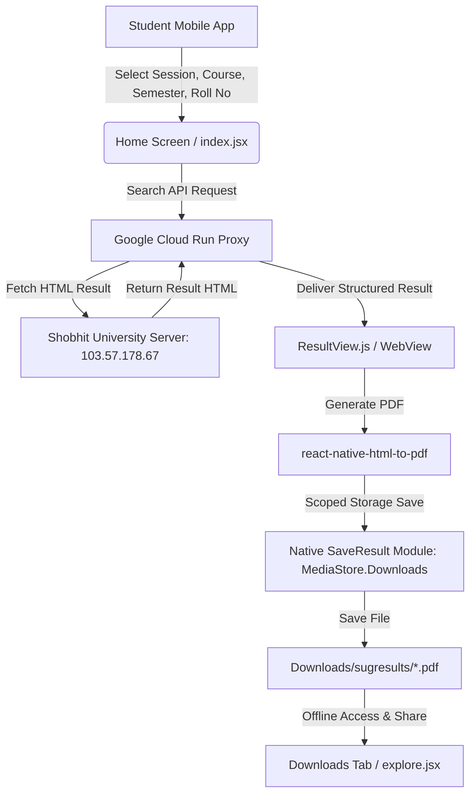

# 🎓 SugResults — Shobhit University Result Portal

<p align="center">
  
</p>

<p align="center">
  <b>A modern, high-performance, and secure mobile application for students of Shobhit University Gangoh to check, download, and manage provisional grade sheets instantly.</b>
</p>

<p align="center">
  
  
  
  
  
  
</p>

---

## 📱 App Screenshots

<p align="center">
  
  &nbsp;
  
  &nbsp;
  
  &nbsp;
  
  &nbsp;
  
</p>

---

## 🌟 Key Features

- **⚡ Instant Result Retrieval**: Direct, secure connection to the university examination server via Google Cloud Run proxy to fetch provisional grade sheets in real time.
- **🎯 4-Step Guided Flow**: Interactive step progress tracker (*Session &rarr; Course &rarr; Semester &rarr; Roll Number*) with auto-scrolling input support when the keyboard opens.
- **🔄 1-Tap Search History & Autofill**: Saves recent lookups locally using `@react-native-async-storage/async-storage`. Tap any card to autofill details instantly, with individual deletion and full history clear actions.
- **🔍 Searchable Bottom Sheet Selectors**: High-performance bottom sheet modals with live search filtering across hundreds of university courses and academic sessions.
- **📄 Offline PDF Generation & Storage**: Converts live grade sheets into formatted PDF documents using `react-native-html-to-pdf` and saves them to the public `Downloads/sugresults/` folder via native Android `MediaStore` scoped storage (`SaveResult.kt`).
- **📥 Downloaded Results Manager**: Dedicated Downloads tab to view, open with system PDF viewers (`react-native-file-viewer`), share via WhatsApp/Drive/Gmail (`expo-sharing`), or delete saved PDFs.
- **🛡️ Android 16 (API 36) Ready**: Fully configured with `compileSdkVersion 36`, `targetSdkVersion 36`, NDK `27.1`, edge-to-edge support with safe area insets, and ProGuard shrinkage.
- **🚀 Ultra-Fast & Lightweight**: Memoized course and semester JSON configurations, native asset logo caching, and pruned dependencies for minimal APK download size.

---

## 🏗️ Architecture & How It Works



---

## 🛠️ Tech Stack & Dependencies

| Component | Technology / Library | Description |
|---|---|---|
| **Core Framework** | `React Native 0.81.5`, `Expo ~54.0.33` | Modern cross-platform app framework |
| **Routing** | `expo-router ~6.0.23` | File-based navigation with native animations |
| **Icons & UI** | `@expo/vector-icons`, University Theme | Ionicons icon set with deep indigo palette |
| **Native Storage Module** | `SaveResult.kt` (`MediaStore.Downloads`) | Scoped storage PDF saver for Android 10+ / 16 |
| **Local Storage** | `@react-native-async-storage/async-storage` | Search history and user pre-fill preferences |
| **Networking** | `axios ^1.13.5` | Fast HTTP client with Cloud Run proxy connection |
| **PDF & File Tools** | `react-native-html-to-pdf`, `react-native-fs`, `react-native-file-viewer`, `expo-sharing` | PDF generation, filesystem access, viewing, and social sharing |
| **Web Rendering** | `react-native-webview ^13.16.0` | Mobile-responsive provisional grade sheet display |
| **Native Build Stack** | `Gradle 8.14.3`, `Kotlin 2.1.20`, `NDK 27.1.12297006` | Android build tools targeting API Level 36 |

---

## 📂 Project Structure

```
sugresults/
├── android/                               # Native Android project configuration
│   ├── app/
│   │   ├── src/main/java/com/mtbyown/sugresults/
│   │   │   ├── MainActivity.kt            # Main React Native activity
│   │   │   ├── MainApplication.kt         # Application class & package registration
│   │   │   ├── SaveResult.kt              # Native MediaStore Scoped Storage PDF saver
│   │   │   └── SaveToDownloadsPackage.kt  # React Native package bridge
│   │   ├── src/main/res/                  # App icons and university splash drawables
│   │   ├── build.gradle                   # App Gradle configuration (SDK 36, ProGuard)
│   │   └── proguard-rules.pro             # Release optimization & code shrinking rules
│   ├── build.gradle                       # Root build configuration (NDK, Kotlin 2.1)
│   └── gradle.properties                  # JVM, Hermes, and target SDK properties
├── app/                                   # Expo Router file-based screens
│   ├── (tabs)/
│   │   ├── _layout.tsx                    # Bottom tab bar (Results, Downloads)
│   │   ├── index.jsx                      # Result search portal & 1-tap search history
│   │   └── explore.jsx                    # Offline PDF Downloads manager
│   ├── ResultView.js                      # Responsive grade sheet display & PDF export
│   └── _layout.tsx                        # Root layout stack & theme provider
├── assets/
│   ├── images/                            # Official Shobhit University logo and app icons
│   └── screenshots/                       # 5 Play Store mockup screenshots (9:16)
├── components/                            # Reusable UI components
│   ├── ActivityIndicator.js               # Branded loading overlay with security badge
│   ├── SessionSelectModal.js              # Searchable bottom sheet selector modal
│   └── logo.jsx                           # Hardware-cached university emblem component
├── constants/
│   └── theme.ts                           # University color theme (#4338CA, #312E81, #F8FAFC)
└── src/
    ├── config/
    │   ├── coursesConfig.json             # Courses mapping per academic session
    │   └── semesterConfig.json            # Semester mapping per course
    └── helper/
        ├── GetResult.js                   # University API proxy caller with timeout handling
        ├── getSessionDropdownOptions.js   # Dynamic session generation helper
        └── storage.js                     # AsyncStorage search history and pre-fill manager
```

---

## 🚀 Getting Started

### Prerequisites

- **Node.js**: `v18` or `v20` LTS
- **Java Development Kit (JDK)**: `JDK 17`
- **Android SDK**: Android 16 (API 36), Build-Tools `36.0.0`
- **NDK**: `27.1.12297006`

### 1. Clone the Repository

```bash
git clone https://github.com/Muqaddas12/sugresults.git
cd sugresults
```

### 2. Install Dependencies

```bash
npm install
```

### 3. Run on Android Emulator / Physical Device

```bash
npm run android
```

Or start the Expo interactive development server:

```bash
npm start
```

---

## 📦 Building for Production

To assemble a signed, optimized release APK with ProGuard code shrinking:

```bash
cd android
./gradlew app:assembleRelease
```

The optimized APK will be generated at:
```
android/app/build/outputs/apk/release/app-release.apk
```

---

## 🔒 Security & Privacy

- **No Student Credentials Required**: Grade sheets are fetched via public university provisional portals using only enrollment/roll numbers.
- **Local-Only Storage**: All search history and saved PDFs remain strictly stored on the user's device and are never transmitted to external analytics servers.
- **HTTPS Encrypted Communication**: All proxy requests are encrypted over standard TLS/HTTPS.

---

## 📄 License

This project is licensed under the **MIT License** — see the [LICENSE](LICENSE) file for details.

---

<p align="center">
  Developed with ❤️ for the students of <b>Shobhit University, Gangoh</b>
</p>
